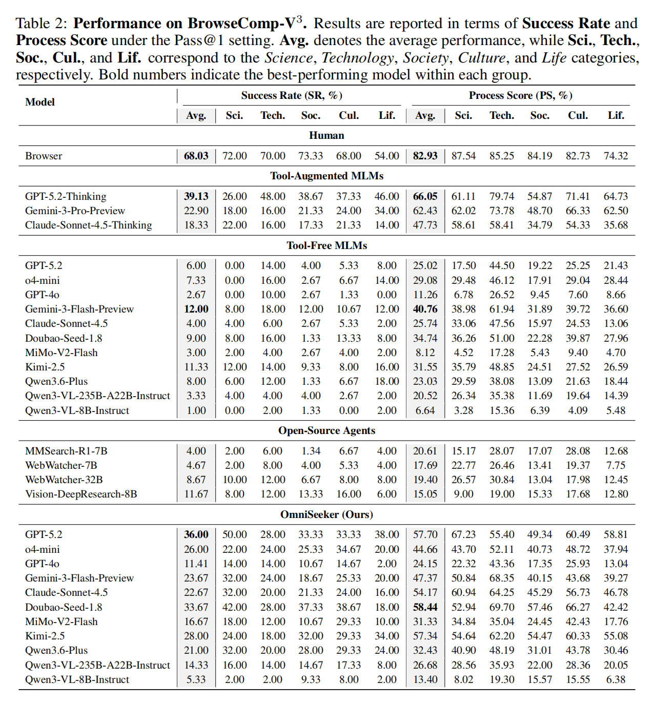
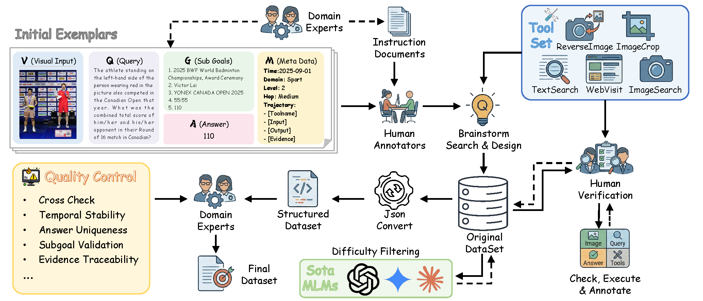
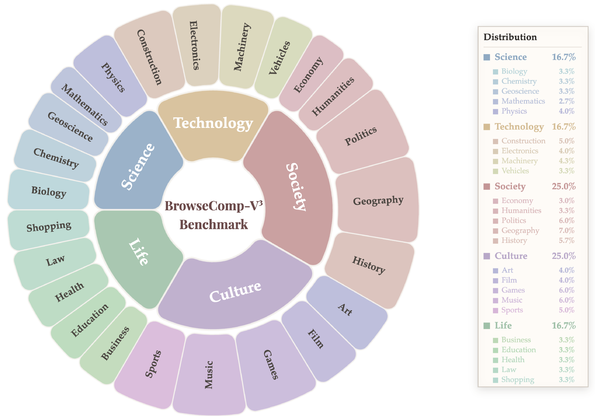
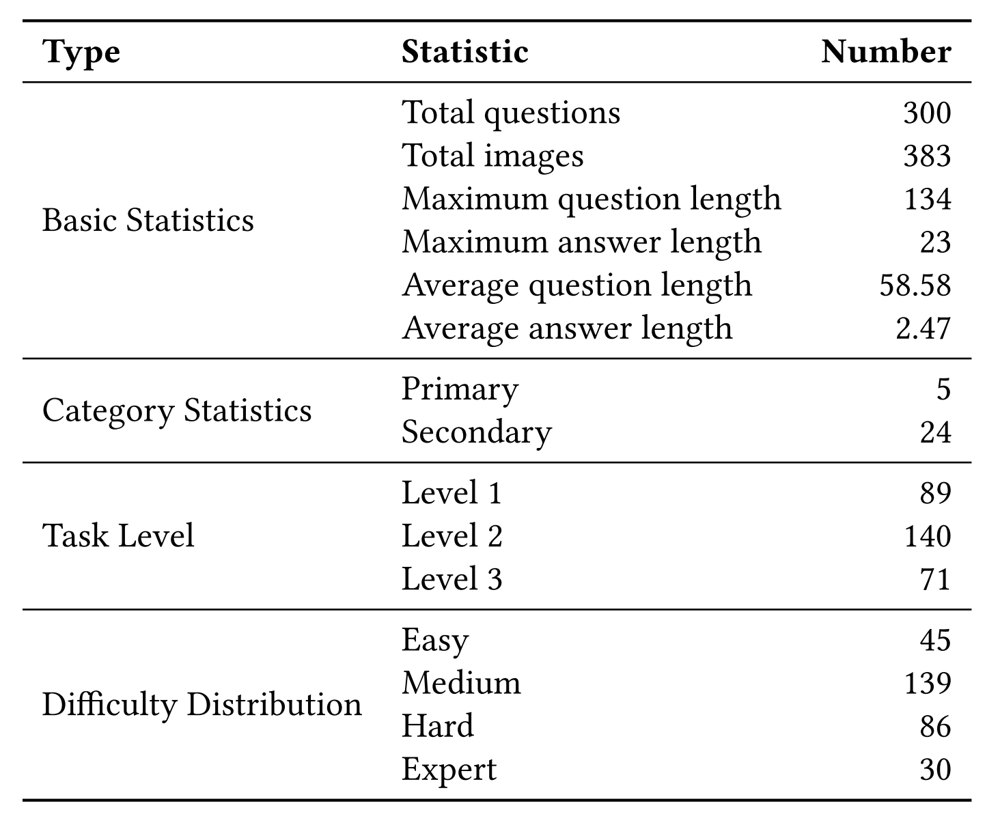
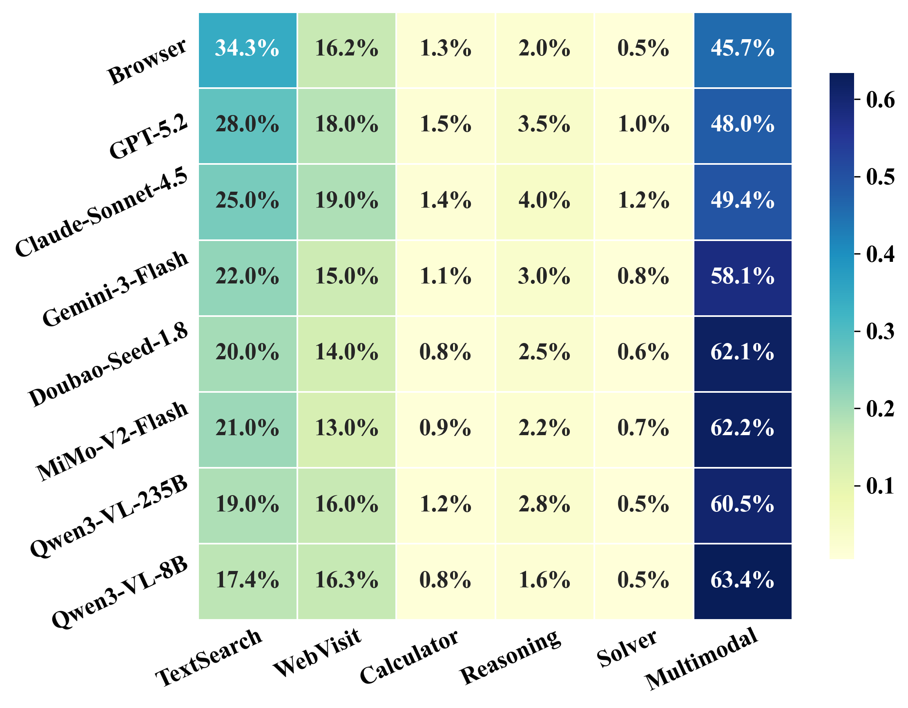
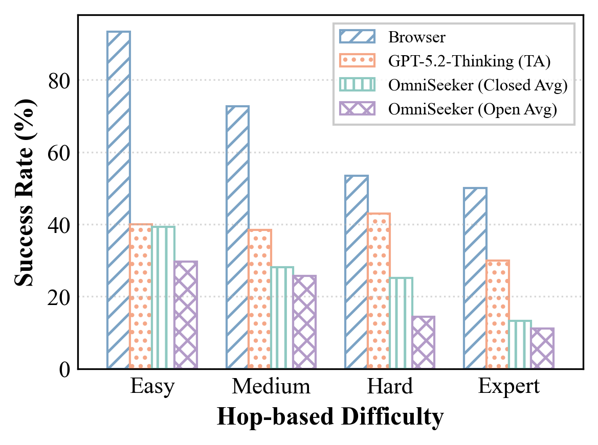
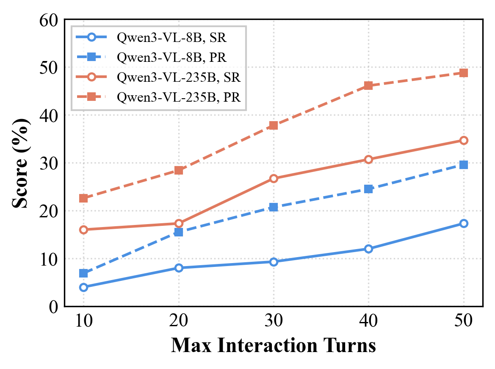
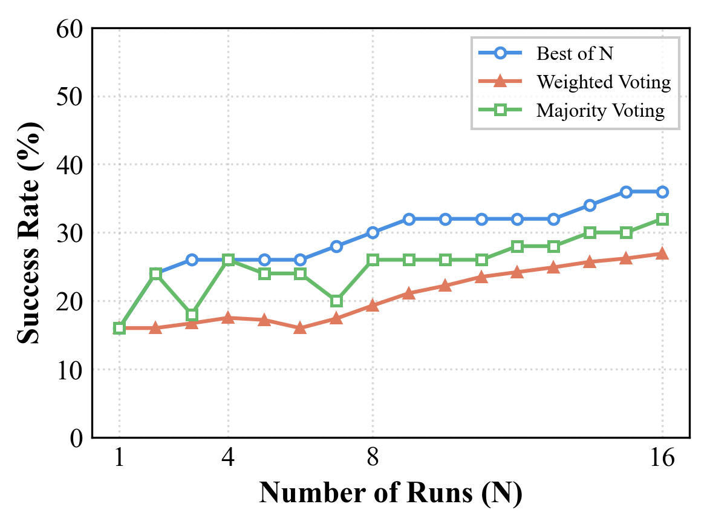
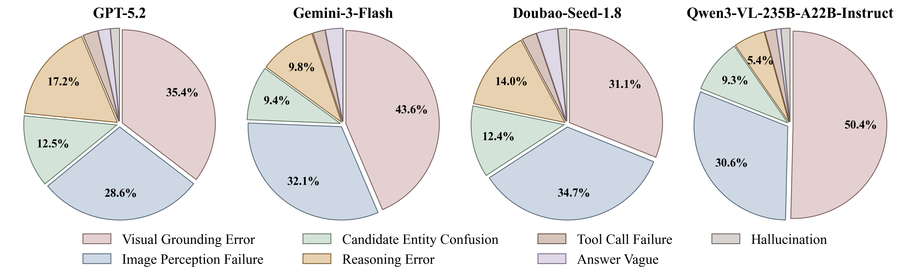

# BrowseComp-V³: A Visual, Vertical, and Verifiable Benchmark for Multimodal Browsing Agents

BrowseComp-V³ is a benchmark for testing whether multimodal browsing agents can really search, inspect, connect, and verify information across the open web.

Multimodal large language models are increasingly used as autonomous agents with planning and tool-use abilities. Yet many existing benchmarks are still too shallow: tasks may be answerable from parametric knowledge, rely on a single lookup, or only evaluate the final answer. BrowseComp-V³ raises the bar with **300 hand-crafted, visually grounded, web-searchable questions** across diverse domains. Each task is designed to require deep, multi-level, cross-modal reasoning rather than a single text search or image guess.

The benchmark emphasizes three things:

- **Visual**: questions depend on images, screenshots, artwork, products, maps, diagrams, or other visual evidence.
- **Vertical**: tasks require multi-hop search depth, often moving from image evidence to entities, pages, dates, objects, and counts.
- **Verifiable**: supporting evidence is publicly searchable, and sub-goal annotations enable process-level evaluation instead of only final-answer scoring.

This release also includes **OmniSeeker**, a lightweight reference runner for tool-aided multimodal browsing experiments.

<p align="center">
  <a href="https://halcyon-zhang.github.io/BrowseComp-V3/"></a>
  &nbsp;&nbsp;&nbsp;&nbsp;
  <a href="https://huggingface.co/datasets/Halcyon-Zhang/BrowseComp-V3"></a>
  &nbsp;&nbsp;&nbsp;&nbsp;
  <a href="https://github.com/Halcyon-Zhang/BrowseComp-V3"></a>
</p>

---

## Results And Dataset Snapshot

<p align="center">
  
</p>

For broader experiment analysis, scaling trends, failure modes, and the latest leaderboard, see the [project page](https://halcyon-zhang.github.io/BrowseComp-V3/).

<p align="center">
  <br/>
  Data construction pipeline of BrowseComp-V³.
</p>

<p align="center">
   &nbsp;&nbsp;
  <br/>
  Left: domain distribution. Right: dataset statistics.
</p>

<p align="center">
  <br/>
  Tool and ability coverage across BrowseComp-V³ tasks.
</p>

<p align="center">
   &nbsp;&nbsp;
   &nbsp;&nbsp;
  <br/>
  Search depth, interaction budget, and repeated-sampling analysis.
</p>

<p align="center">
  <br/>
  Failure modes highlight bottlenecks in multimodal evidence integration and fine-grained perception.
</p>

---

## What Is Included

```text
BrowseComp-V3/
├── requirements.txt
├── scripts/                 # dataset download, decryption, score summary
├── examples/                # baseline rollout and judge evaluation
├── omniseeker/              # OmniSeeker reference runner
├── docs/                    # data and setup guides
└── tests/                   # smoke tests for the release layout
```

Generated local data uses this structure:

```text
data/
├── raw/                     # downloaded Hugging Face snapshot
└── samples/                 # decrypted per-sample JSONs
    ├── images/              # copied image assets
    └── <sample-id>.json
```

## Quick Start

```bash
conda create -n browsecomp-v3 python=3.11
conda activate browsecomp-v3
pip install -r requirements.txt
```

```bash
python scripts/download_dataset.py --output-dir data/raw
printf '%s\n' 'A_Visual_Vertical_Verifiable_Benchmark_for_Multimodal_Browsing_Agents' > key.txt
python scripts/decrypt_batch.py \
  --input data/raw/data/train.jsonl \
  --key-file key.txt \
  --output-dir data/samples \
  --copy-images data/raw
```

Copy `.env.template` to `.env` and fill in model/search keys.

## Run The Baseline

```bash
python examples/baseline_rollout.py \
  --data_dir data/samples \
  --data_root data/samples \
  --output_dir results/baseline \
  --dry_run
```

## Run OmniSeeker

```bash
bash omniseeker/run_bench.sh \
  --data-dir data/samples \
  --example 1 \
  --num-rollouts 1 \
  --max-turns 20
```

## Evaluate And Summarize

```bash
python examples/eval_rollout_results.py --input_dir results/baseline/gpt-4o --judge_model gpt-4o
python scripts/summarize_eval_scores.py results/baseline/gpt-4o/eval_gpt-4o.jsonl
```

See [`docs/data.md`](docs/data.md) and [`docs/setup.md`](docs/setup.md) for details.

## Citation

```bibtex
@article{zhang2026browsecompv3,
  title   = {BrowseComp-$V^3$: A Visual, Vertical, and Verifiable Benchmark for Multimodal Browsing Agents},
  author  = {Huanyao Zhang and Jiepeng Zhou and Bo Li and Bowen Zhou and Yanzhe Shan and Haishan Lu and Zhiyong Cao and Jiaoyang Chen and Yuqian Han and Zinan Sheng and Zhengwei Tao and Hao Liang and Jialong Wu and Yang Shi and Yuanpeng He and Jiaye Lin and Qintong Zhang and Guochen Yan and Runhao Zhao and Zhengpin Li and Xiaohan Yu and Lang Mei and Chong Chen and Wentao Zhang and Bin Cui},
  journal = {arXiv preprint arXiv:2602.12876},
  year    = {2026}
}
```

## License

CC BY 4.0. See the [dataset card](https://huggingface.co/datasets/Halcyon-Zhang/BrowseComp-V3) for details.
